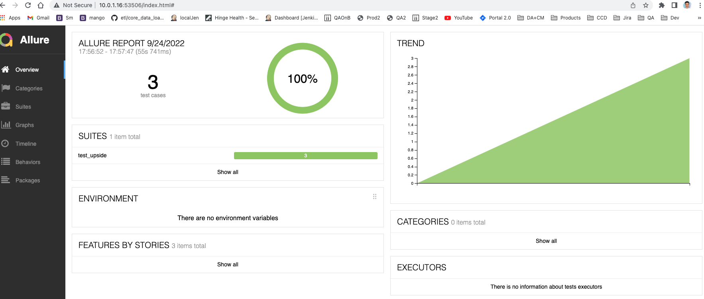
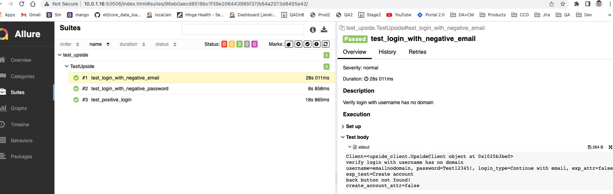

# Upside Assessment
## Description
* Using your QA automation skillset, write test cases and automate tests around our sign up with email workflow for our Android test app.
* Please find the test Android application here: https://drive.google.com/file/d/1H4CptDGu2CWJh3lHTCLaOH0t2mOD8fuG/view?usp=sharing

* Please see documentation here for some help around Appium and Allure, if needed:

* https://github.com/clarabez/appium-en

* (For stretch goal, if needed) https://docs.qameta.io/allure#_get_started

## Automated Testcases
* Verify login with username has no domain.
* Verify password without special char.
* Verify valid username and password.
* **For Signup, I can come up more than 20 test cases easily.**

## Requirements
Write automated tests for the sign up with email feature. Please ensure you are utilizing the following:

* Appium (npm install -g appium; npm install -g appium-doctor --android; appium-doctor)
* Python version 3.5 or higher
* Pytest
* (Stretch, nice to have) Allure report
* Please include instructions on how to run the tests.

## How To Run Tests
* Start UI Appium App 
* Create Android device either from Android Studio or command line ($ANDROID_HOME/tools/bin/avdmanager create avd -n Android_Device -k "system-images;android-33;google_apis;x86_64")
* Start Emulator either from Android Studio or command line ($ANDROID_HOME/tools/emulator -avd Android_Device)
* Download this package from here to a directory.
* Install upside_beta.apk to device. (adb install upside_beta.apk)
* pytest --show-capture=stdout --alluredir=reports/  test_upside.py
* generate allure reports: allure serve reports/

Ressults:
dennynguyen@dnguyen-MD6M upside % pytest --show-capture=stdout --alluredir=reports/  test_upside.py
============================ test session starts =============================================================
platform darwin -- Python 3.9.7, pytest-6.2.5, py-1.10.0, pluggy-0.13.1
rootdir: /Users/dennynguyen/Projects/upside
plugins: allure-pytest-2.9.45, bdd-4.1.0
collected 3 items

test_upside.py ...                                                                                                                         [100%]

test_upside.py::TestUpside::test_login_with_negative_email
============================ 3 passed, 1 warning in 66.57s (0:01:06) =========================================
dennynguyen@dnguyen-MD6M upside % allure serve reports/
OUTPUT:

